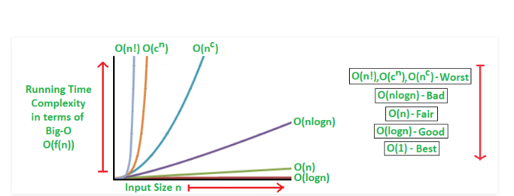

  

# Sorting Algorithms  

There are many variations and more sorting algorithms, but I decided to present
the following as an overview. If you would like to learn or know about other
algorithms please refer to the [Citation](#Citation).  

Since C and C++ share some similarities, the only difference in the solutions is that the C++
solutions will be done using classes and objects. Additionally instead of arrays,
the C++ solutions will also be done using vectors.  

*This is a work in progress!*  

**Sorting Algorithms in C**    

Average Time Complexities     
 
- [Insertion Sort O(n^2)](C/insertion_sort.c)        
- [Merge Sort O(n log n)](C/merge_sort.c)      
- [Quick Sort O(n log n)](C/quick_sort.c)   
- [Selection Sort O(n^2)](C/selection_sort.c)      
- [Bubble Sort O(n^2)](C/bubble_sort.c)      

**Sorting Algorithms in C++**   

Average Time Complexities   
 
- Insertion Sort O(n^2)      
- Merge Sort O(n log n)    
- Quick Sort O(n log n)    
- Selection Sort O(n^2)     
- Bubble Sort O(n^2)     

**Citation:**   

- GeeksForGeeks - [Website](https://www.geeksforgeeks.org/sorting-algorithms/)    
- GeeksForGeeks Time Complexities - [Website](https://www.geeksforgeeks.org/time-complexities-of-all-sorting-algorithms/)  
- Competitive Programming - [EBook](https://cses.fi/book/index.php)  
- Image from GeeksForGeeks - [link](https://www.geeksforgeeks.org/analysis-algorithms-big-o-analysis/)  
